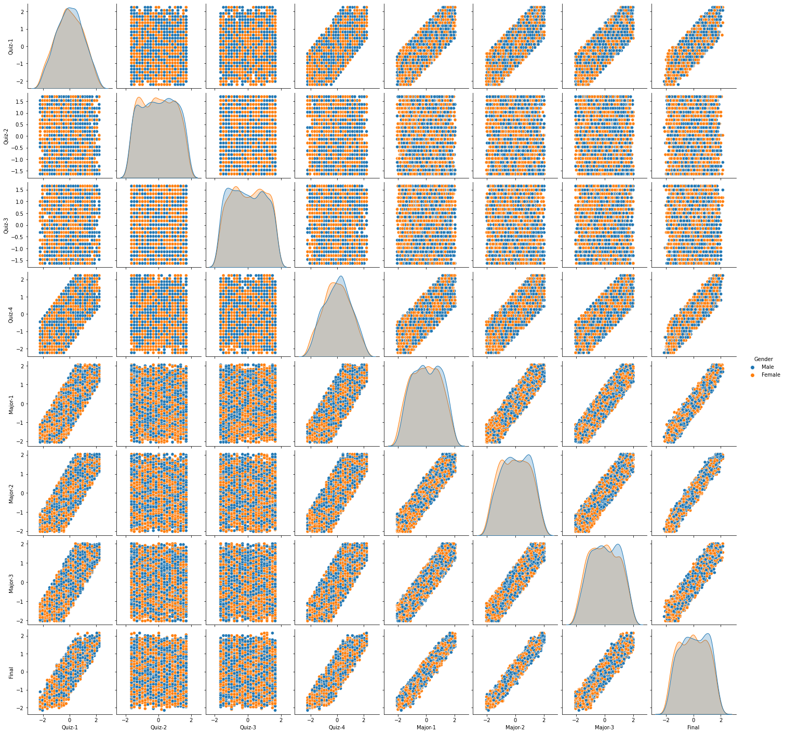
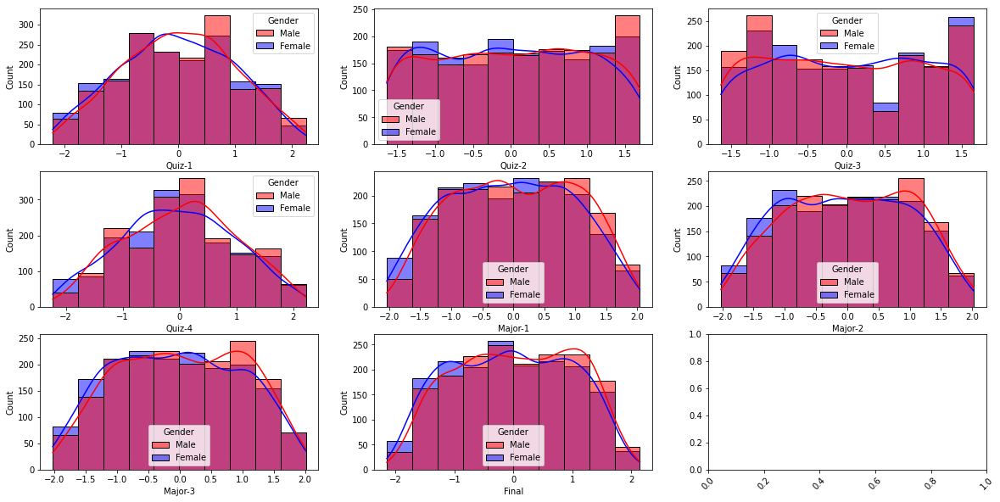
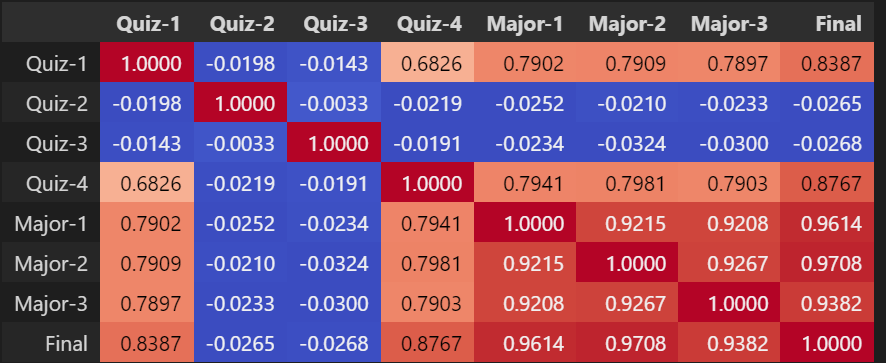
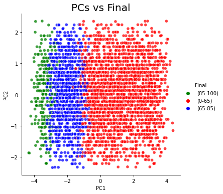
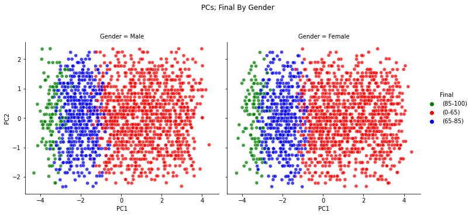
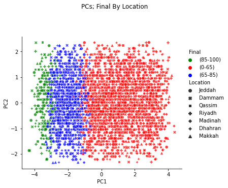

# Student Exam Scores

In this project, I analyzed data related to student scores and reduced the dimensionality of the data to keep the most important features only.

Then, I built a predictive model to test the hypothesis that the quiz and major exam scores are linearly related to the final exam score.

<h1>Table of Contents<span class="tocSkip"></span></h1>
<div class="toc"><ul class="toc-item"><li><span><a href="#Problem-#A" data-toc-modified-id="Problem-#A-1"><span class="toc-item-num">1&nbsp;&nbsp;</span>Problem #A: Exploratory Data Analysis Using Correlation and Principal Components for Student Scores</a></span></li><li><span><a href="#Problem-#B" data-toc-modified-id="Problem-#B-2"><span class="toc-item-num">2&nbsp;&nbsp;</span>Problem #B: Regression Analysis for Student Scores

## Metadata and Details

To perform the required analysis, there are 3 datasets with the following details:

Consider data given in file StudentScoresDataA and the following data description:

Table 1: Data Description

| Field   |      Description      |
|----------|:-------------:|
| Gender |  Gender of the student |
| Location | Home City of the student   |
| Quiz-1 | Score of the student in Quiz-1 |
| Quiz-2   |  Score of the student in Quiz-2     |
| Quiz-3 | Score of the student in Quiz-3 |
| Quiz-4 |  Score of the student in Quiz-4 |
| Major-1 |  Score of the student in Major-1 |
| Major-2 | Score of the student in Major-2 |
| Major-3 | Score of the student in Major-3 |
| Final | Score of the student in the final exam |


# Problem #A

Do the following tasks using data given in **StudentScoresDataA** and Table-1:

*A*-1: **Given Data.** Read and display the data. Identify the number of rows and columns. Does any column have missing data? Display the description of both numeric and non-numeric columns.

*A*-2: **Type Consistency.** For each column in **StudentScoresDataA**, identify type of each field and verify that each column in Python is identified correctly. If there is any inconsistency, then resolve it.

*A*-3: **Normalization.** For each score column in **StudentScoresDataA**, apply the standard scaler, such that the mean is zero and standard deviation is one.

*A*-4: **Visualization.** Draw pairwise scatter plots each pair of score columns in **StudentScoresDataA**. Also, for each score column draw KDE (Kernel Density Estimation). Differentiate the pairwise plots and KDE plot by ’Gender’ column.

*A*-5: **Correlation Analysis.** Do the following:
Calculate the correlation between all the score columns of **StudentScoresDataA**.
Identify top 3 variables that are highly correlated with ’Final’ score column. Which pair of score columns are strongly correlated?

*A*-6: **PCA.** Do the following:
Get first two principal components of the data without considering ’Gender’, ’Location’ and ’Final’ columns.
Add the two principal components to the data frame and rename the components ’PC1’ and ’PC2’ respectively.
Construct a scatter plot using the first two principal components of the data. Can the principal components separate ’Final’ variable?
Differentiate the above plot using ’Gender’. In a separate plot, differentiate the above plot using ’Location’. How much variation do each principal component capture? What are the coefficients (the *u* vector) of the linear combination of input variables for the first PC?

# Problem #A

```python
#A-1: Understanding the Given Data:
import pandas as pd
import numpy as np
df = pd.read_csv('StudentScoresDataA.csv', delimiter =',')
display(df)


# Count the number of rows and columns in the data
print(f'The number of rows are {len(df.index)}, and the number of columns are {len(df.columns)}')
# Count the number of non-null rows for each column
print(f'The number of non-null rows for each column are:\n{df.count()}')
null =df.columns[df.isna().any()]
print(f'The columns containing missing data are:\n{null}') # No columns containing missing data
display(df.describe(include="number"))# only numerical
display(df.describe(include="object")) # only categorical
```


<table border="1" class="dataframe">
  <thead>
    <tr style="text-align: right;">
      <th></th>
      <th>Gender</th>
      <th>Location</th>
      <th>Quiz-1</th>
      <th>Quiz-2</th>
      <th>Quiz-3</th>
      <th>Quiz-4</th>
      <th>Major-1</th>
      <th>Major-2</th>
      <th>Major-3</th>
      <th>Final</th>
    </tr>
  </thead>
  <tbody>
    <tr>
      <th>0</th>
      <td>Male</td>
      <td>Jeddah</td>
      <td>17</td>
      <td>17</td>
      <td>24</td>
      <td>16</td>
      <td>100</td>
      <td>92</td>
      <td>85</td>
      <td>86</td>
    </tr>
    <tr>
      <th>1</th>
      <td>Female</td>
      <td>Jeddah</td>
      <td>10</td>
      <td>21</td>
      <td>14</td>
      <td>8</td>
      <td>16</td>
      <td>28</td>
      <td>17</td>
      <td>25</td>
    </tr>
    <tr>
      <th>2</th>
      <td>Female</td>
      <td>Jeddah</td>
      <td>7</td>
      <td>21</td>
      <td>23</td>
      <td>7</td>
      <td>55</td>
      <td>45</td>
      <td>41</td>
      <td>43</td>
    </tr>
    <tr>
      <th>3</th>
      <td>Male</td>
      <td>Dammam</td>
      <td>22</td>
      <td>10</td>
      <td>21</td>
      <td>12</td>
      <td>80</td>
      <td>70</td>
      <td>67</td>
      <td>68</td>
    </tr>
    <tr>
      <th>4</th>
      <td>Female</td>
      <td>Dammam</td>
      <td>21</td>
      <td>15</td>
      <td>17</td>
      <td>18</td>
      <td>81</td>
      <td>79</td>
      <td>78</td>
      <td>81</td>
    </tr>
    <tr>
      <th>...</th>
      <td>...</td>
      <td>...</td>
      <td>...</td>
      <td>...</td>
      <td>...</td>
      <td>...</td>
      <td>...</td>
      <td>...</td>
      <td>...</td>
      <td>...</td>
    </tr>
    <tr>
      <th>3495</th>
      <td>Female</td>
      <td>Riyadh</td>
      <td>15</td>
      <td>25</td>
      <td>20</td>
      <td>15</td>
      <td>87</td>
      <td>93</td>
      <td>89</td>
      <td>81</td>
    </tr>
    <tr>
      <th>3496</th>
      <td>Male</td>
      <td>Dammam</td>
      <td>15</td>
      <td>14</td>
      <td>17</td>
      <td>8</td>
      <td>48</td>
      <td>45</td>
      <td>46</td>
      <td>43</td>
    </tr>
    <tr>
      <th>3497</th>
      <td>Male</td>
      <td>Riyadh</td>
      <td>20</td>
      <td>23</td>
      <td>20</td>
      <td>18</td>
      <td>71</td>
      <td>77</td>
      <td>82</td>
      <td>73</td>
    </tr>
    <tr>
      <th>3498</th>
      <td>Female</td>
      <td>Riyadh</td>
      <td>10</td>
      <td>16</td>
      <td>6</td>
      <td>12</td>
      <td>63</td>
      <td>68</td>
      <td>49</td>
      <td>60</td>
    </tr>
    <tr>
      <th>3499</th>
      <td>Male</td>
      <td>Dammam</td>
      <td>12</td>
      <td>12</td>
      <td>24</td>
      <td>5</td>
      <td>37</td>
      <td>36</td>
      <td>26</td>
      <td>34</td>
    </tr>
  </tbody>
</table>
<p>3500 rows × 10 columns</p>
</div>


    The number of rows are 3500, and the number of columns are 10
    The number of non-null rows for each column are:
    Gender      3500
    Location    3500
    Quiz-1      3500
    Quiz-2      3500
    Quiz-3      3500
    Quiz-4      3500
    Major-1     3500
    Major-2     3500
    Major-3     3500
    Final       3500
    dtype: int64
    The columns containing missing data are:
    Index([], dtype='object')
    


<table border="1" class="dataframe">
  <thead>
    <tr style="text-align: right;">
      <th></th>
      <th>Quiz-1</th>
      <th>Quiz-2</th>
      <th>Quiz-3</th>
      <th>Quiz-4</th>
      <th>Major-1</th>
      <th>Major-2</th>
      <th>Major-3</th>
      <th>Final</th>
    </tr>
  </thead>
  <tbody>
    <tr>
      <th>count</th>
      <td>3500.000000</td>
      <td>3500.000000</td>
      <td>3500.000000</td>
      <td>3500.000000</td>
      <td>3500.000000</td>
      <td>3500.000000</td>
      <td>3500.000000</td>
      <td>3500.000000</td>
    </tr>
    <tr>
      <th>mean</th>
      <td>12.414571</td>
      <td>14.814857</td>
      <td>14.924286</td>
      <td>12.523714</td>
      <td>55.954571</td>
      <td>55.949143</td>
      <td>56.154286</td>
      <td>54.019714</td>
    </tr>
    <tr>
      <th>std</th>
      <td>5.618516</td>
      <td>6.001572</td>
      <td>6.094121</td>
      <td>5.612041</td>
      <td>21.552887</td>
      <td>21.734182</td>
      <td>21.803054</td>
      <td>21.418980</td>
    </tr>
    <tr>
      <th>min</th>
      <td>0.000000</td>
      <td>5.000000</td>
      <td>5.000000</td>
      <td>0.000000</td>
      <td>12.000000</td>
      <td>12.000000</td>
      <td>12.000000</td>
      <td>8.000000</td>
    </tr>
    <tr>
      <th>25%</th>
      <td>8.000000</td>
      <td>10.000000</td>
      <td>10.000000</td>
      <td>8.000000</td>
      <td>38.000000</td>
      <td>38.000000</td>
      <td>38.000000</td>
      <td>36.000000</td>
    </tr>
    <tr>
      <th>50%</th>
      <td>12.000000</td>
      <td>15.000000</td>
      <td>15.000000</td>
      <td>13.000000</td>
      <td>56.000000</td>
      <td>56.000000</td>
      <td>56.000000</td>
      <td>54.000000</td>
    </tr>
    <tr>
      <th>75%</th>
      <td>17.000000</td>
      <td>20.000000</td>
      <td>20.000000</td>
      <td>17.000000</td>
      <td>74.000000</td>
      <td>74.000000</td>
      <td>74.000000</td>
      <td>72.000000</td>
    </tr>
    <tr>
      <th>max</th>
      <td>25.000000</td>
      <td>25.000000</td>
      <td>25.000000</td>
      <td>25.000000</td>
      <td>100.000000</td>
      <td>100.000000</td>
      <td>100.000000</td>
      <td>100.000000</td>
    </tr>
  </tbody>
</table>
</div>


<table border="1" class="dataframe">
  <thead>
    <tr style="text-align: right;">
      <th></th>
      <th>Gender</th>
      <th>Location</th>
    </tr>
  </thead>
  <tbody>
    <tr>
      <th>count</th>
      <td>3500</td>
      <td>3500</td>
    </tr>
    <tr>
      <th>unique</th>
      <td>2</td>
      <td>7</td>
    </tr>
    <tr>
      <th>top</th>
      <td>Male</td>
      <td>Madinah</td>
    </tr>
    <tr>
      <th>freq</th>
      <td>1756</td>
      <td>519</td>
    </tr>
  </tbody>
</table>
</div>


```python
#A-2: Check for Type Consistency
df.info()
print('''As can be seen from the data above and the info below:
gender is object Dtype as it should be.
Location is object Dtype as it should be.
Quiz-1 is numerical as it should be.
Quiz-2 is numerical as it should be.
Quiz-3 is numerical as it should be.
Quiz-4 is numerical as it should be. 
Major-1 is numerical as it should be. 
Major-2 is numerical as it should be. 
Major-3 is numerical as it should be. 
Final is numerical as it should be.''')
```

    <class 'pandas.core.frame.DataFrame'>
    RangeIndex: 3500 entries, 0 to 3499
    Data columns (total 10 columns):
     #   Column    Non-Null Count  Dtype 
    ---  ------    --------------  ----- 
     0   Gender    3500 non-null   object
     1   Location  3500 non-null   object
     2   Quiz-1    3500 non-null   int64 
     3   Quiz-2    3500 non-null   int64 
     4   Quiz-3    3500 non-null   int64 
     5   Quiz-4    3500 non-null   int64 
     6   Major-1   3500 non-null   int64 
     7   Major-2   3500 non-null   int64 
     8   Major-3   3500 non-null   int64 
     9   Final     3500 non-null   int64 
    dtypes: int64(8), object(2)
    memory usage: 273.6+ KB
    As can be seen from the data above and the info below:
    gender is object Dtype as it should be.
    Location is object Dtype as it should be.
    Quiz-1 is numerical as it should be.
    Quiz-2 is numerical as it should be.
    Quiz-3 is numerical as it should be.
    Quiz-4 is numerical as it should be. 
    Major-1 is numerical as it should be. 
    Major-2 is numerical as it should be. 
    Major-3 is numerical as it should be. 
    Final is numerical as it should be.
    


```python
#A-3: Normalization: normalizae the data such that the mean is zero and standard deviation is one.
from sklearn.preprocessing import StandardScaler # import
selected_columns = df.select_dtypes(include="number").columns
for c in selected_columns:
    scaler = StandardScaler() # creating object
    scaler.fit(df[[c]]) # fitting
    df[c]= scaler.transform(df[[c]]) #transforming
    print(f'The mean and std values for {c} are', abs(np.round(df[c].mean())), ' and ', np.round(df[c].std()))
display(df)
```

    The mean and std values for Quiz-1 are 0.0  and  1.0
    The mean and std values for Quiz-2 are 0.0  and  1.0
    The mean and std values for Quiz-3 are 0.0  and  1.0
    The mean and std values for Quiz-4 are 0.0  and  1.0
    The mean and std values for Major-1 are 0.0  and  1.0
    The mean and std values for Major-2 are 0.0  and  1.0
    The mean and std values for Major-3 are 0.0  and  1.0
    The mean and std values for Final are 0.0  and  1.0
    


<table border="1" class="dataframe">
  <thead>
    <tr style="text-align: right;">
      <th></th>
      <th>Gender</th>
      <th>Location</th>
      <th>Quiz-1</th>
      <th>Quiz-2</th>
      <th>Quiz-3</th>
      <th>Quiz-4</th>
      <th>Major-1</th>
      <th>Major-2</th>
      <th>Major-3</th>
      <th>Final</th>
    </tr>
  </thead>
  <tbody>
    <tr>
      <th>0</th>
      <td>Male</td>
      <td>Jeddah</td>
      <td>0.816245</td>
      <td>0.364147</td>
      <td>1.489470</td>
      <td>0.619522</td>
      <td>2.043890</td>
      <td>1.658954</td>
      <td>1.323202</td>
      <td>1.493295</td>
    </tr>
    <tr>
      <th>1</th>
      <td>Female</td>
      <td>Jeddah</td>
      <td>-0.429814</td>
      <td>1.030734</td>
      <td>-0.151690</td>
      <td>-0.806188</td>
      <td>-1.854057</td>
      <td>-1.286137</td>
      <td>-1.796073</td>
      <td>-1.355053</td>
    </tr>
    <tr>
      <th>2</th>
      <td>Female</td>
      <td>Jeddah</td>
      <td>-0.963839</td>
      <td>1.030734</td>
      <td>1.325354</td>
      <td>-0.984402</td>
      <td>-0.044296</td>
      <td>-0.503847</td>
      <td>-0.695153</td>
      <td>-0.514557</td>
    </tr>
    <tr>
      <th>3</th>
      <td>Male</td>
      <td>Dammam</td>
      <td>1.706287</td>
      <td>-0.802381</td>
      <td>0.997122</td>
      <td>-0.093333</td>
      <td>1.115807</td>
      <td>0.646579</td>
      <td>0.497511</td>
      <td>0.652799</td>
    </tr>
    <tr>
      <th>4</th>
      <td>Female</td>
      <td>Dammam</td>
      <td>1.528278</td>
      <td>0.030853</td>
      <td>0.340658</td>
      <td>0.975949</td>
      <td>1.162211</td>
      <td>1.060732</td>
      <td>1.002100</td>
      <td>1.259824</td>
    </tr>
    <tr>
      <th>...</th>
      <td>...</td>
      <td>...</td>
      <td>...</td>
      <td>...</td>
      <td>...</td>
      <td>...</td>
      <td>...</td>
      <td>...</td>
      <td>...</td>
      <td>...</td>
    </tr>
    <tr>
      <th>3495</th>
      <td>Female</td>
      <td>Riyadh</td>
      <td>0.460228</td>
      <td>1.697322</td>
      <td>0.833006</td>
      <td>0.441308</td>
      <td>1.440636</td>
      <td>1.704971</td>
      <td>1.506688</td>
      <td>1.259824</td>
    </tr>
    <tr>
      <th>3496</th>
      <td>Male</td>
      <td>Dammam</td>
      <td>0.460228</td>
      <td>-0.135793</td>
      <td>0.340658</td>
      <td>-0.806188</td>
      <td>-0.369125</td>
      <td>-0.503847</td>
      <td>-0.465794</td>
      <td>-0.514557</td>
    </tr>
    <tr>
      <th>3497</th>
      <td>Male</td>
      <td>Riyadh</td>
      <td>1.350270</td>
      <td>1.364028</td>
      <td>0.833006</td>
      <td>0.975949</td>
      <td>0.698170</td>
      <td>0.968698</td>
      <td>1.185587</td>
      <td>0.886270</td>
    </tr>
    <tr>
      <th>3498</th>
      <td>Female</td>
      <td>Riyadh</td>
      <td>-0.429814</td>
      <td>0.197500</td>
      <td>-1.464618</td>
      <td>-0.093333</td>
      <td>0.326937</td>
      <td>0.554545</td>
      <td>-0.328179</td>
      <td>0.279245</td>
    </tr>
    <tr>
      <th>3499</th>
      <td>Male</td>
      <td>Dammam</td>
      <td>-0.073797</td>
      <td>-0.469087</td>
      <td>1.489470</td>
      <td>-1.340829</td>
      <td>-0.879570</td>
      <td>-0.918001</td>
      <td>-1.383228</td>
      <td>-0.934805</td>
    </tr>
  </tbody>
</table>
<p>3500 rows × 10 columns</p>
</div>


```python
#A-4: Data Visualization:
import matplotlib.pyplot as plt
import seaborn as sns

plt.figure()
sns.pairplot(vars=selected_columns,kind="scatter",hue ='Gender',data=df)#pairwise scatter plot for each numerical pair
plt.show()
#-----
plt.figure
nCols=3   # How many columns wanted
nRows=len(selected_columns)//nCols+1
fig,axes = plt.subplots(nRows, nCols, figsize=(20,10)) 

for ind,col in enumerate(selected_columns): #each numerical column  (تاكد)
    sns.histplot(x=col,bins=10,ax = axes.flatten()[ind],hue ='Gender',kde=True,palette=['r','b'],data=df) 
    plt.xticks(rotation=45)
plt.show()
```


    <Figure size 432x288 with 0 Axes>


    

    


    

    


```python
#A-5: Correlation Analysis
corr = df.corr()
display(corr.style.background_gradient(cmap='coolwarm').set_precision(4))

corr=corr.apply(lambda x: np.abs(x)) # negative correlation will be considered
sorted_corr = corr.sort_values(by=['Final'], ascending=False)#sort by : to get what variables are correlated with Final
sorted_corr = sorted_corr['Final'].index # store the indecies here to access them next
print('The top three correlated input variables are: ',sorted_corr[1:4].tolist())# discarding 0 (Final vs. Final = 1)

#Which pair of score columns are strongly correlated?
# Quiz-1 is highly correlated with (Quiz-4, Major-1, Major-2, Major-3)
# Quiz-4 is highly correlated with (Quiz-1, Major-1, Major-2, Major-3)
# Major-1 is highly correlated with (Quiz-1, Quiz-4, Major-2, Major-3)
# Major-2 is highly correlated with (Quiz-1, Quiz-4, Major-1, Major-3)
# Major-3 is highly correlated with (Quiz-1, Quiz-4, Major-1, Major-2)
# The pair that is strongly correlated is (Major-2 vs. Final) 
```


    The top three correlated input variables are:  ['Major-2', 'Major-1', 'Major-3']
    
 


```python
#A-6: Principal Component Analysis 
pca_input_columns=selected_columns.drop(['Final']) # only numerical and without the output (Final)
from sklearn.decomposition import PCA 
pca = PCA(n_components=2)
principalComponents = pca.fit_transform(df[pca_input_columns]) 
df['PC1'] = principalComponents[:,0] 
df['PC2'] = principalComponents[:,1] 
# #-----
# Draw the PCAs using the normalized values, but use the original data to differentiate (coloring legends) 
df_copy = pd.read_csv('StudentScoresDataA.csv', delimiter =',') #keeping a copy of the original dataframe to set the legends
custom_hue = df_copy['Final'].apply(lambda x: "(85-100)" if x>=85 else ("(65-85)" if x>=65 and x<85
                                   else "(0-65)"))
plt.figure()
sns.relplot(x='PC1',y='PC2',
            hue = custom_hue, palette=['g','r','b'],
            kind='scatter',alpha=0.75,
            height=5, aspect=1, 
            data=df)
plt.title('PCs vs Final', fontsize = 20)
plt.show()
print(f'The PCs show good separation, with some overlap. even without using Final as an input')
# By Gender:
plt.figure()
Gender = sns.relplot(x='PC1',y='PC2',
            hue = custom_hue, palette=['g','r','b'], 
            col = "Gender",
            kind='scatter',alpha=0.75,
            height=5, aspect=1, 
            data=df)
Gender.fig.suptitle('PCs; Final By Gender') 
Gender.fig.subplots_adjust(top = 0.8)
plt.show()
# By Location:
plt.figure()
Location = sns.relplot(x='PC1',y='PC2', 
            hue = custom_hue, palette=['g','r','b'], 
            style = "Location", 
            kind='scatter',alpha=0.75,
            height=5, aspect=1, 
            data=df)
Location.fig.suptitle('PCs; Final By Location') 
Location.fig.subplots_adjust(top = 0.8)
plt.show()
#----   
# How much variation do each principal component capture?
for ind,var in enumerate(pca.explained_variance_ratio_):
    print(f'The variance captured by pca {ind+1} is: {var*100: 0.2f}%')
#What are the coeffcients (the u vector) of the linear combination of input variables for the first PC?
pca_1_coefficients=np.round(pca.components_[0],4)
zipList=list(zip(pca_input_columns,pca_1_coefficients))
# create new dataframe >> this is just to display it as a dataframe
ndf=pd.DataFrame.from_records(zipList,columns=['field','coeff']) # give new columns and display in df for visula
display(ndf.sort_values(by=['coeff'], ascending=False)) 
```


    <Figure size 432x288 with 0 Axes>


    

    


    The PCs show good separation, with some overlap. even without using Final as an input
    


    <Figure size 432x288 with 0 Axes>


    

    


    <Figure size 432x288 with 0 Axes>


    

    


    The variance captured by pca 1 is:  61.31%
    The variance captured by pca 2 is:  14.33%
    


<table border="1" class="dataframe">
  <thead>
    <tr style="text-align: right;">
      <th></th>
      <th>field</th>
      <th>coeff</th>
    </tr>
  </thead>
  <tbody>
    <tr>
      <th>2</th>
      <td>Quiz-3</td>
      <td>0.0163</td>
    </tr>
    <tr>
      <th>1</th>
      <td>Quiz-2</td>
      <td>0.0151</td>
    </tr>
    <tr>
      <th>0</th>
      <td>Quiz-1</td>
      <td>-0.4213</td>
    </tr>
    <tr>
      <th>3</th>
      <td>Quiz-4</td>
      <td>-0.4227</td>
    </tr>
    <tr>
      <th>4</th>
      <td>Major-1</td>
      <td>-0.4626</td>
    </tr>
    <tr>
      <th>6</th>
      <td>Major-3</td>
      <td>-0.4628</td>
    </tr>
    <tr>
      <th>5</th>
      <td>Major-2</td>
      <td>-0.4638</td>
    </tr>
  </tbody>
</table>
</div>


# Problem #B


Consider data given in CSV file **StudentScoresDataB** . Consider the following data description:

Table 2: Data Description

| Field   |      Description      |
|----------|:-------------:|
| Quiz-1 | Score of the student in Quiz-1 |
| Quiz-2   |  Score of the student in Quiz-2     |
| Quiz-3 | Score of the student in Quiz-3 |
| Quiz-4 |  Score of the student in Quiz-4 |
| Major-1 |  Score of the student in Major-1 |
| Major-2 | Score of the student in Major-2 |
| Major-3 | Score of the student in Major-3 |
| Final | Score of the student in the final exam |


Do the following tasks using data given in **StudentScoresDataB** and Table-2:

*B*-1: **Given Data.** Read and display the data. Identify the number of rows and columns. Does any column have missing data? Display the statistical summaries of all the columns.

*B*-2: **Type Consistency.** For each column in **StudentScoresDataB**, identify the type for each field based on value. Also, identify the datatypes in Python. Report and resolve any inconsistency.

*B*-3: **Normalization.** For each column in **StudentScoresDataB**, apply the standard scaler, such that the mean is zero and standard deviation is one. Display the summaries of all the columns.

*B*-4: **Cross Normalization.** For each column in **StudentScoresDataC**, apply the standard scaler fitted (learned) from **StudentScoresDataB** data. Display the summaries of all the columns in **StudentScoresDataC** data.

*B*-5: **OLS Regression.** The hypothesis is that the quiz and major exam scores are linearly related to final exam score. Use the following formula to calculate the OLS coefficient estimates of all **StudentScoresDataB** data. Take column ‘Final’ as the output column, and all other columns as input column.


*B*-6: **OLS Regression.** The hypothesis is that the quiz and major exam scores are linearly related to the final exam score. Do the following:
Use the sklearn library to calculate the OLS coefficient estimates of all **StudentScoresDataB** data. Take column ‘Final’ as the output column, and all other columns as input column. Compare the coefficients obtained in Part *B*-5 with the above coefficients. Report any differences in between the coefficients from Parts *B*-5 and *B*-6. Using the above OLS coefficient estimates, calculate the MSE for data given in **StudentScoresDataC**.

*B*-7: **Ridge Regression.** It may be possible that the quiz and major exam scores are not really independent. Thus, the coefficients needs regularization (penalization). Do the following:
Do the ridge analysis, taking all **StudentScoresDataB** data as the training data. Use 10-fold cross validation, and pick thebest value of alpha from 10*−*3*,* 10*−*2*,* 10*−*1*,* 100*,* 101*,* 102*,* 103. 
Using the above coefficient estimates, calculate the MSE for data given in **StudentScoresDataC**.


*B*-8: **Lasso Regression.** It may be possible that not all the quiz and major exam scores are helpful in predicting final score. Thus, the coefficients needs selection (penalization). Do the following:
Do the lasso analysis, taking all **StudentScoresDataB** data as the training data. Use 10-fold cross validation, and pick thebest value of alpha from 10*−*3*,* 10*−*2*,* 10*−*1*,* 100*,* 101*,* 102*,* 103.
Using the above coefficient estimates, calculate the MSE for data given in **StudentScoresDataC**.

*B*-9: **Regression Analysis.** Compare and contrast the coefficient estimates obtained from Parts *B*-6, *B*-7, *B*-8 and *B*-9.


```python
#B-1: Understand the Given Data:
import pandas as pd
import numpy as np
df = pd.read_csv('StudentScoresDataB.csv', delimiter =',')
display(df)


# Count the number of rows and columns in the data
print(f'The number of rows are {len(df.index)}, and the number of columns are {len(df.columns)}')
# Count the number of non-null rows for each column
print(f'The number of non-null rows for each column are:\n{df.count()}')
null =df.columns[df.isna().any()]
print(f'The columns containing missing data are:\n{null}') # No columns containing missing data
display(df.describe())# only numerical
```


<table border="1" class="dataframe">
  <thead>
    <tr style="text-align: right;">
      <th></th>
      <th>Quiz-1</th>
      <th>Quiz-2</th>
      <th>Quiz-3</th>
      <th>Quiz-4</th>
      <th>Major-1</th>
      <th>Major-2</th>
      <th>Major-3</th>
      <th>Final</th>
    </tr>
  </thead>
  <tbody>
    <tr>
      <th>0</th>
      <td>21</td>
      <td>5</td>
      <td>14</td>
      <td>20</td>
      <td>84</td>
      <td>82</td>
      <td>92</td>
      <td>86</td>
    </tr>
    <tr>
      <th>1</th>
      <td>13</td>
      <td>21</td>
      <td>10</td>
      <td>10</td>
      <td>40</td>
      <td>41</td>
      <td>44</td>
      <td>38</td>
    </tr>
    <tr>
      <th>2</th>
      <td>4</td>
      <td>7</td>
      <td>24</td>
      <td>7</td>
      <td>27</td>
      <td>22</td>
      <td>25</td>
      <td>20</td>
    </tr>
    <tr>
      <th>3</th>
      <td>22</td>
      <td>7</td>
      <td>19</td>
      <td>14</td>
      <td>81</td>
      <td>92</td>
      <td>93</td>
      <td>84</td>
    </tr>
    <tr>
      <th>4</th>
      <td>8</td>
      <td>6</td>
      <td>17</td>
      <td>9</td>
      <td>30</td>
      <td>39</td>
      <td>33</td>
      <td>36</td>
    </tr>
    <tr>
      <th>...</th>
      <td>...</td>
      <td>...</td>
      <td>...</td>
      <td>...</td>
      <td>...</td>
      <td>...</td>
      <td>...</td>
      <td>...</td>
    </tr>
    <tr>
      <th>2894</th>
      <td>13</td>
      <td>15</td>
      <td>11</td>
      <td>10</td>
      <td>68</td>
      <td>60</td>
      <td>72</td>
      <td>60</td>
    </tr>
    <tr>
      <th>2895</th>
      <td>9</td>
      <td>11</td>
      <td>7</td>
      <td>6</td>
      <td>27</td>
      <td>27</td>
      <td>28</td>
      <td>26</td>
    </tr>
    <tr>
      <th>2896</th>
      <td>11</td>
      <td>13</td>
      <td>9</td>
      <td>8</td>
      <td>55</td>
      <td>51</td>
      <td>48</td>
      <td>49</td>
    </tr>
    <tr>
      <th>2897</th>
      <td>15</td>
      <td>25</td>
      <td>21</td>
      <td>8</td>
      <td>46</td>
      <td>46</td>
      <td>38</td>
      <td>43</td>
    </tr>
    <tr>
      <th>2898</th>
      <td>16</td>
      <td>16</td>
      <td>10</td>
      <td>18</td>
      <td>73</td>
      <td>81</td>
      <td>79</td>
      <td>73</td>
    </tr>
  </tbody>
</table>
<p>2899 rows × 8 columns</p>
</div>


    The number of rows are 2899, and the number of columns are 8
    The number of non-null rows for each column are:
    Quiz-1     2899
    Quiz-2     2899
    Quiz-3     2899
    Quiz-4     2899
    Major-1    2899
    Major-2    2899
    Major-3    2899
    Final      2899
    dtype: int64
    The columns containing missing data are:
    Index([], dtype='object')
    


<table border="1" class="dataframe">
  <thead>
    <tr style="text-align: right;">
      <th></th>
      <th>Quiz-1</th>
      <th>Quiz-2</th>
      <th>Quiz-3</th>
      <th>Quiz-4</th>
      <th>Major-1</th>
      <th>Major-2</th>
      <th>Major-3</th>
      <th>Final</th>
    </tr>
  </thead>
  <tbody>
    <tr>
      <th>count</th>
      <td>2899.000000</td>
      <td>2899.000000</td>
      <td>2899.000000</td>
      <td>2899.000000</td>
      <td>2899.000000</td>
      <td>2899.000000</td>
      <td>2899.000000</td>
      <td>2899.000000</td>
    </tr>
    <tr>
      <th>mean</th>
      <td>12.574681</td>
      <td>15.077268</td>
      <td>15.058296</td>
      <td>12.563298</td>
      <td>55.942049</td>
      <td>55.930321</td>
      <td>55.997240</td>
      <td>53.903415</td>
    </tr>
    <tr>
      <th>std</th>
      <td>5.526165</td>
      <td>6.101757</td>
      <td>6.115778</td>
      <td>5.688581</td>
      <td>21.771147</td>
      <td>21.761616</td>
      <td>21.796679</td>
      <td>21.396040</td>
    </tr>
    <tr>
      <th>min</th>
      <td>0.000000</td>
      <td>5.000000</td>
      <td>5.000000</td>
      <td>0.000000</td>
      <td>12.000000</td>
      <td>12.000000</td>
      <td>12.000000</td>
      <td>7.000000</td>
    </tr>
    <tr>
      <th>25%</th>
      <td>9.000000</td>
      <td>10.000000</td>
      <td>10.000000</td>
      <td>8.000000</td>
      <td>37.000000</td>
      <td>38.000000</td>
      <td>37.000000</td>
      <td>36.000000</td>
    </tr>
    <tr>
      <th>50%</th>
      <td>13.000000</td>
      <td>15.000000</td>
      <td>15.000000</td>
      <td>13.000000</td>
      <td>56.000000</td>
      <td>56.000000</td>
      <td>56.000000</td>
      <td>54.000000</td>
    </tr>
    <tr>
      <th>75%</th>
      <td>17.000000</td>
      <td>20.000000</td>
      <td>20.000000</td>
      <td>17.000000</td>
      <td>74.000000</td>
      <td>75.000000</td>
      <td>74.000000</td>
      <td>72.000000</td>
    </tr>
    <tr>
      <th>max</th>
      <td>25.000000</td>
      <td>25.000000</td>
      <td>25.000000</td>
      <td>25.000000</td>
      <td>100.000000</td>
      <td>100.000000</td>
      <td>100.000000</td>
      <td>100.000000</td>
    </tr>
  </tbody>
</table>
</div>


```python
#B-2: Check for Type Consistency
df.info()
print('''As can be seen from the data above and the info below:
Quiz-1 is numerical as it should be.
Quiz-2 is numerical as it should be.
Quiz-3 is numerical as it should be.
Quiz-4 is numerical as it should be. 
Major-1 is numerical as it should be. 
Major-2 is numerical as it should be. 
Major-3 is numerical as it should be. 
Final is numerical as it should be.''')
```

    <class 'pandas.core.frame.DataFrame'>
    RangeIndex: 2899 entries, 0 to 2898
    Data columns (total 8 columns):
     #   Column   Non-Null Count  Dtype
    ---  ------   --------------  -----
     0   Quiz-1   2899 non-null   int64
     1   Quiz-2   2899 non-null   int64
     2   Quiz-3   2899 non-null   int64
     3   Quiz-4   2899 non-null   int64
     4   Major-1  2899 non-null   int64
     5   Major-2  2899 non-null   int64
     6   Major-3  2899 non-null   int64
     7   Final    2899 non-null   int64
    dtypes: int64(8)
    memory usage: 181.3 KB
    As can be seen from the data above and the info below:
    Quiz-1 is numerical as it should be.
    Quiz-2 is numerical as it should be.
    Quiz-3 is numerical as it should be.
    Quiz-4 is numerical as it should be. 
    Major-1 is numerical as it should be. 
    Major-2 is numerical as it should be. 
    Major-3 is numerical as it should be. 
    Final is numerical as it should be.
    


```python
#B-3: Normalization: Normalize the values such that the mean is zero and standard deviation is one
from sklearn.preprocessing import StandardScaler # import
scaler = StandardScaler()
scaler.fit(df)
df = pd.DataFrame(scaler.transform(df),columns=df.columns)
for c in df.columns:
    print(f'The mean and std values for {c} are', abs(np.round(df[c].mean())), ' and ', np.round(df[c].std()))
display(df.describe())# only numerical
```

    The mean and std values for Quiz-1 are 0.0  and  1.0
    The mean and std values for Quiz-2 are 0.0  and  1.0
    The mean and std values for Quiz-3 are 0.0  and  1.0
    The mean and std values for Quiz-4 are 0.0  and  1.0
    The mean and std values for Major-1 are 0.0  and  1.0
    The mean and std values for Major-2 are 0.0  and  1.0
    The mean and std values for Major-3 are 0.0  and  1.0
    The mean and std values for Final are 0.0  and  1.0
    


<table border="1" class="dataframe">
  <thead>
    <tr style="text-align: right;">
      <th></th>
      <th>Quiz-1</th>
      <th>Quiz-2</th>
      <th>Quiz-3</th>
      <th>Quiz-4</th>
      <th>Major-1</th>
      <th>Major-2</th>
      <th>Major-3</th>
      <th>Final</th>
    </tr>
  </thead>
  <tbody>
    <tr>
      <th>count</th>
      <td>2.899000e+03</td>
      <td>2.899000e+03</td>
      <td>2.899000e+03</td>
      <td>2.899000e+03</td>
      <td>2.899000e+03</td>
      <td>2.899000e+03</td>
      <td>2.899000e+03</td>
      <td>2.899000e+03</td>
    </tr>
    <tr>
      <th>mean</th>
      <td>2.450993e-18</td>
      <td>3.125015e-17</td>
      <td>-1.115202e-16</td>
      <td>-1.470596e-16</td>
      <td>9.803970e-18</td>
      <td>-1.470596e-17</td>
      <td>3.186290e-17</td>
      <td>1.323536e-16</td>
    </tr>
    <tr>
      <th>std</th>
      <td>1.000173e+00</td>
      <td>1.000173e+00</td>
      <td>1.000173e+00</td>
      <td>1.000173e+00</td>
      <td>1.000173e+00</td>
      <td>1.000173e+00</td>
      <td>1.000173e+00</td>
      <td>1.000173e+00</td>
    </tr>
    <tr>
      <th>min</th>
      <td>-2.275873e+00</td>
      <td>-1.651821e+00</td>
      <td>-1.644931e+00</td>
      <td>-2.208893e+00</td>
      <td>-2.018710e+00</td>
      <td>-2.019055e+00</td>
      <td>-2.018878e+00</td>
      <td>-2.192532e+00</td>
    </tr>
    <tr>
      <th>25%</th>
      <td>-6.469762e-01</td>
      <td>-8.322430e-01</td>
      <td>-8.272322e-01</td>
      <td>-8.023240e-01</td>
      <td>-8.702030e-01</td>
      <td>-8.240846e-01</td>
      <td>-8.717162e-01</td>
      <td>-8.369074e-01</td>
    </tr>
    <tr>
      <th>50%</th>
      <td>7.697787e-02</td>
      <td>-1.266543e-02</td>
      <td>-9.533704e-03</td>
      <td>7.678148e-02</td>
      <td>2.662286e-03</td>
      <td>3.202484e-03</td>
      <td>1.266270e-04</td>
      <td>4.514933e-03</td>
    </tr>
    <tr>
      <th>75%</th>
      <td>8.009320e-01</td>
      <td>8.069121e-01</td>
      <td>8.081648e-01</td>
      <td>7.800659e-01</td>
      <td>8.295873e-01</td>
      <td>8.764500e-01</td>
      <td>8.260830e-01</td>
      <td>8.459372e-01</td>
    </tr>
    <tr>
      <th>max</th>
      <td>2.248840e+00</td>
      <td>1.626490e+00</td>
      <td>1.625863e+00</td>
      <td>2.186635e+00</td>
      <td>2.024034e+00</td>
      <td>2.025460e+00</td>
      <td>2.019131e+00</td>
      <td>2.154816e+00</td>
    </tr>
  </tbody>
</table>
</div>


```python
#B-4: Cross Normalization: apply the standard scaler fitted from StudentScoresDataB
df2 = pd.read_csv('StudentScoresDataC.csv', delimiter =',')
from sklearn.preprocessing import StandardScaler
df2 = pd.DataFrame(scaler.transform(df2),columns=df.columns)
for c2 in df2.columns:
    print(f'The mean and std values for {c2} are', abs(np.round(df2[c2].mean())), ' and ', np.round(df2[c2].std()))
display(df2.describe())
```

    The mean and std values for Quiz-1 are 0.0  and  1.0
    The mean and std values for Quiz-2 are 0.0  and  1.0
    The mean and std values for Quiz-3 are 0.0  and  1.0
    The mean and std values for Quiz-4 are 0.0  and  1.0
    The mean and std values for Major-1 are 0.0  and  1.0
    The mean and std values for Major-2 are 0.0  and  1.0
    The mean and std values for Major-3 are 0.0  and  1.0
    The mean and std values for Final are 0.0  and  1.0
    


<table border="1" class="dataframe">
  <thead>
    <tr style="text-align: right;">
      <th></th>
      <th>Quiz-1</th>
      <th>Quiz-2</th>
      <th>Quiz-3</th>
      <th>Quiz-4</th>
      <th>Major-1</th>
      <th>Major-2</th>
      <th>Major-3</th>
      <th>Final</th>
    </tr>
  </thead>
  <tbody>
    <tr>
      <th>count</th>
      <td>324.000000</td>
      <td>324.000000</td>
      <td>324.000000</td>
      <td>324.000000</td>
      <td>324.000000</td>
      <td>324.000000</td>
      <td>324.000000</td>
      <td>324.000000</td>
    </tr>
    <tr>
      <th>mean</th>
      <td>-0.044798</td>
      <td>-0.088552</td>
      <td>0.116654</td>
      <td>-0.108265</td>
      <td>-0.059300</td>
      <td>-0.078363</td>
      <td>-0.034855</td>
      <td>0.013316</td>
    </tr>
    <tr>
      <th>std</th>
      <td>1.031785</td>
      <td>1.034225</td>
      <td>0.956155</td>
      <td>1.038197</td>
      <td>0.999085</td>
      <td>1.021849</td>
      <td>1.021145</td>
      <td>1.075939</td>
    </tr>
    <tr>
      <th>min</th>
      <td>-2.275873</td>
      <td>-1.651821</td>
      <td>-1.644931</td>
      <td>-2.208893</td>
      <td>-2.018710</td>
      <td>-1.927134</td>
      <td>-2.018878</td>
      <td>-2.005549</td>
    </tr>
    <tr>
      <th>25%</th>
      <td>-0.692223</td>
      <td>-0.996158</td>
      <td>-0.663692</td>
      <td>-0.802324</td>
      <td>-0.870203</td>
      <td>-0.916005</td>
      <td>-0.883188</td>
      <td>-0.942085</td>
    </tr>
    <tr>
      <th>50%</th>
      <td>-0.104011</td>
      <td>-0.176581</td>
      <td>0.154006</td>
      <td>-0.099040</td>
      <td>-0.089218</td>
      <td>-0.134679</td>
      <td>0.000127</td>
      <td>0.004515</td>
    </tr>
    <tr>
      <th>75%</th>
      <td>0.800932</td>
      <td>0.806912</td>
      <td>0.971704</td>
      <td>0.604245</td>
      <td>0.737707</td>
      <td>0.784529</td>
      <td>0.826083</td>
      <td>0.951115</td>
    </tr>
    <tr>
      <th>max</th>
      <td>2.067852</td>
      <td>1.626490</td>
      <td>1.625863</td>
      <td>2.186635</td>
      <td>1.886214</td>
      <td>1.979500</td>
      <td>1.927358</td>
      <td>2.154816</td>
    </tr>
  </tbody>
</table>
</div>


```python
#B-5: OLS Regression: The hypothesis is that the quiz and major exam scores are linearly related to final exam score.
import numpy as np
X = df.iloc[:,:-1].values # No need to add a new ones column, since we applied standard scaler
y = df.iloc[:,-1].values
best_beta = np.linalg.inv(X.T @ X) @ X.T @ y 
print('The closed form estimates are:', np.round(best_beta,2).tolist())
```

    The closed form estimates are: [0.1, -0.0, -0.0, 0.22, 0.32, 0.42, 0.0]
    


```python
#B-6: OLS Regression (Using sklearn)
from sklearn.linear_model import LinearRegression
reg1 = LinearRegression().fit(X, y)
best_betas =  np.round(reg1.coef_,2) # beta 1,2,....
best_beta_0 = np.round(reg1.intercept_,2) # beta note
print(f'The estimates using sklearn are :', best_beta_0, best_betas.tolist()) # beta note is 0.0
print(f'It appears to have the same estimates as the OLS closed form (found in B-5 above)')
#-----
X_train = df.iloc[:,:-1].values # the training set is represented by dataB
y_train = df.iloc[:,-1].values
X_test = df2.iloc[:,:-1].values # the testing set is represented by dataC
y_test = df2.iloc[:,-1].values
#--------
#Using the above OLS coeffcient estimates, calculate the MSE for data given in HW5DataC
## OLS (Ordinary Least Squares Linear Regression)
from sklearn.metrics import mean_squared_error
y_pred1 = reg1.predict(X_test)
print('The MSE using OLS is:', mean_squared_error(y_test, y_pred1))
```

    The estimates using sklearn are : 0.0 [0.1, -0.0, -0.0, 0.22, 0.32, 0.42, 0.0]
    It appears to have the same estimates as the OLS closed form (found in B-5 above)
    The MSE using OLS is: 0.01842862368733385
    


```python
#B-7: Ridge Regression. It may be possible that the quiz and major exam scores are not really independent. 
# Thus, the coefficients needs regularization (penalization).
## Ridge
from sklearn.linear_model import RidgeCV
reg2 = RidgeCV(alphas=[1e-3, 1e-2, 1e-1, 1e0, 1e1, 1e2, 1e3], fit_intercept=False,cv=10).fit(X_train, y_train) 
y_pred2 = reg2.predict(X_test) 
print('The MSE using OLS is:', mean_squared_error(y_test, y_pred2))
```

    The MSE using OLS is: 0.018428417221315444
    


```python
#B-8: Lasso Regression. It may be possible that not all the quiz and major exam scores are helpful in predicting final score. 
# Thus, the coefficients needs selection (penalization).
## Lasso
from sklearn.linear_model import LassoCV 
reg3 = LassoCV(alphas=[1e-3, 1e-2, 1e-1, 1e0, 1e1, 1e2, 1e3], 
               fit_intercept=False,cv=10, random_state=0).fit(X_train, y_train) 
y_pred3 = reg3.predict(X_test) 
print('The MSE using Lasso is:', mean_squared_error(y_test, y_pred3))
```

    The MSE using Lasso is: 0.018509010803085785
    


```python
#B-9: Regression Analysis: Compare and contrast the coefficient estimates
print('The coefficient estimates using OLS Regression are:', np.round(reg1.coef_,3))
print('The coefficient estimates using Ridge Regression are:', np.round(reg2.coef_,3))
print('The coefficient estimates using Lasso Regression are',np.round(reg3.coef_,3))
print()
#As can be seen from the result below, the coefficient estimates are very similar 
best_MSE = min(mean_squared_error(y_test, y_pred1),mean_squared_error(y_test, y_pred2),mean_squared_error(y_test, y_pred3))
print(f'Ridge performs better than OLS and Lasso for this data with minumum MSE of {best_MSE}')
```

    The coefficient estimates using OLS Regression are: [ 0.104 -0.001 -0.002  0.218  0.317  0.421  0.001]
    The coefficient estimates using Ridge Regression are: [ 0.104 -0.001 -0.002  0.218  0.317  0.421  0.001]
    The coefficient estimates using Lasso Regression are [ 0.104 -0.    -0.001  0.218  0.318  0.421  0.   ]
    
    Ridge performs better than OLS and Lasso for this data with minumum MSE of 0.018428417221315444
    
## 🛠 Skills Used
Python, Exploratory Data Analysis, Principal Component Analysis, Linear Regression, Ridge Regression, Lasso Regression, Normalization, Correlation Analysis

## 🚀 About Me
👋 Hi, I’m @Raed-Alshehri

👀 I’m interested in data science, machine learning, and statistics.

🌱 I’m applying my skills in the data analytics field using Python, R, and SQL


## 🔗 Links
[](https://raed-alshehri.github.io/RaedAlshehri.github.io/)
[](https://www.linkedin.com/in/raedalshehri/)


## Feedback

If you have any feedback, please reach out to me at alshehri.raeda@gmail.com

